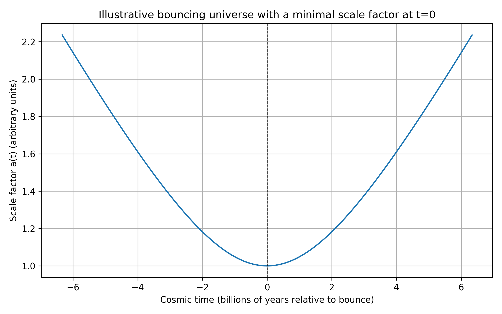

# Universe Inside a Black Hole? Evaluating and Extending Black‑Hole Cosmology

**Author:** Prabhu Sadasivam
**ORCID:** [0009-0008-0069-693X](https://orcid.org/0009-0008-0069-693X)
**Date:** April 2026

## Abstract

Some recent popular‐science videos and articles claim that the observable universe might lie inside a black hole. These claims draw on a variety of proposals — from Raj Pathria's 1972 suggestion that the Friedmann universe could be matched to a Schwarzschild black hole, to Nikodem Popławski's spin–torsion cosmology, and more recent "Black‑Hole Universe" models that replace the Big Bang with a gravitational bounce. This report reviews the major theoretical frameworks behind black‑hole cosmology, examines the observational evidence and criticisms, performs simple calculations of the universe's Schwarzschild radius, presents an illustrative bounce simulation, and outlines possible future research directions. The analysis shows that while black‑hole cosmologies are mathematically intriguing and can sometimes address issues such as the Big‑Bang singularity, there is currently no compelling observational evidence that we live inside a black hole. Nevertheless, the hypothesis stimulates valuable questions about gravity, quantum mechanics and cosmic evolution.

## 1 Introduction

Black holes and cosmology share notable similarities. Both exhibit horizons — the event horizon of a black hole and the cosmological horizon beyond which we cannot observe — and both involve extremely high densities. It is therefore tempting to ask whether the entire observable universe could be the interior of a black hole. Proponents suggest that the Big Bang may not be a singular beginning but rather a bounce following gravitational collapse in a "parent" universe. The idea appears in viral videos and social‑media posts, but determining its validity requires careful examination of the underlying physics and evidence. This report assesses the historical development, theoretical mechanisms and observational tests of black‑hole cosmology.

## 2 Historical models and theoretical frameworks

### 2.1 Raj Pathria's closed‐universe black‑hole model (1972)

Raj Pathria observed that the metric inside a pressureless, closed Friedmann–Lemaître–Robertson–Walker (FLRW) universe resembles the interior of a Schwarzschild black hole at the moment when the FLRW scale factor reaches its maximum. In a 1972 paper in *Nature*, he argued that the universe could be not only a closed structure but "also be a black hole, confined to a localized region of space which cannot expand without limit" [1]. Pathria's argument required a positive cosmological constant tuned so that the universe's radius equalled its Schwarzschild radius at the moment of maximum expansion. Later work by Frolov, Markov and Mukhanov refined this limiting curvature hypothesis, matching a Schwarzschild exterior to a de Sitter interior that avoids the singularity [2]. These models were mathematically interesting but did not explain how a collapsing universe would connect to our expanding one.

### 2.2 Spin–torsion cosmology and Popławski's Big‑Bounce

General relativity assumes a symmetric affine connection, but in the Einstein–Cartan–Sciama–Kibble theory the connection can possess torsion. Fermionic matter described by Dirac spinors sources torsion and generates a spin–spin repulsion at extremely high densities. In this framework, the repulsive spin–spin interaction prevents gravitational singularities and leads to a non‑singular bounce, allowing a collapsing black hole to spawn a new universe via an Einstein–Rosen bridge [3]. Nikodem Popławski has developed this idea extensively. In an arXiv paper on gravitational collapse with torsion, he shows that torsion replaces the singularity with a bounce; quantum particle creation during contraction prevents shear from overcoming torsion, while particle creation during expansion can cause inflation and produce large amounts of matter [4]. The resulting closed universe may undergo several oscillatory bounces before dark energy drives permanent expansion [5].

### 2.3 Quantum degeneracy pressure and limiting curvature

Another mechanism for a bounce arises from quantum degeneracy pressure. The Pauli exclusion principle forbids fermions (e.g., electrons) from occupying the same quantum state, generating a pressure that resists compression. In white‑dwarf stars, this electron degeneracy pressure balances gravity and stabilises the star [6]. Some recent black‑hole universe models generalise this idea: when matter in a collapsing region reaches densities above nuclear density, the degeneracy pressure or other quantum effects can halt collapse, leading to a gravitational bounce. The limiting curvature hypothesis proposed by Frolov and others also introduces an upper bound on curvature invariants to prevent singularities [7].

## 3 The 2025 "Black‑Hole Universe" model

In June 2025, an international team led by Enrique Gaztañaga published a paper in *Physical Review D* proposing a "Black‑Hole Universe" model. A press release from the University of Portsmouth summarises the key points: instead of the universe beginning from a singularity, the model considers gravitational collapse of an overdense region in a parent universe, forming a massive black hole [8]. Quantum‑mechanical effects provide a pressure that halts the collapse at extremely high density and triggers a bounce. The matter rebounding from the bounce expands into a new universe remarkably similar to our own; in Gaztañaga's words, the collapse "does not have to end in a singularity" [9]. The bounce occurs within general relativity combined with quantum mechanics — no speculative fields are invoked [10] — and the rebound naturally produces two phases of accelerated expansion, corresponding to cosmic inflation and dark‑energy domination [11]. A striking prediction is that the resulting universe should have a small positive spatial curvature; the model therefore suggests that future surveys might detect slight curvature [12]. The authors also note that their model could explain the origin of supermassive black holes and provide new perspectives on dark matter and galaxy formation [13].

## 4 Observational hints: galaxy‑spin asymmetry and rotation

Proponents of black‑hole cosmology sometimes point to potential observational signatures. One such hint arises from a rotation asymmetry in galaxy spin directions. Using data from the JWST Advanced Deep Extragalactic Survey (JADES), Lior Shamir analysed 263 spiral galaxies and found that 105 rotated counter‑clockwise and 158 rotated clockwise [14]. In a random and isotropic universe, roughly half the galaxies should spin each way; the observed excess of clockwise rotations led Shamir to suggest that the universe might be rotating [15]. A ScienceAlert summary notes that one explanation for the asymmetry is that the universe was born rotating — a scenario consistent with black‑hole cosmology — though it also offers the mundane possibility that the effect arises from the rotation of our home galaxy or measurement biases [16]. The same article emphasises that the sample size is small (263 galaxies), and rotation estimates are tricky [17].

## 5 Criticisms and challenges

### 5.1 Lack of compelling evidence

Mainstream cosmologists remain sceptical. *Scientific American* columnist Paul Sutter points out that the supposed galaxy‑spin signal relies on a tiny fraction of the billions of galaxies observed. He emphasises that large surveys containing millions of galaxies show no evidence for a rotating universe, and any detected asymmetries have been traced to selection effects [18]. Shamir's analysis used stringent filters (face‑on spirals near the Milky Way's rotation pole), which can easily introduce bias [19]. A conclusion based on 263 galaxies, Sutter notes, cannot overturn cosmological models built on hundreds of millions of observations [20].

### 5.2 Differences between black holes and the universe

While black holes and the universe share the concept of horizons, their singularities differ. In a black hole the singularity is spatial — a point deep inside the hole — whereas in cosmology the Big Bang singularity is a moment in time. Sutter emphasises that inside a black hole everything falls inward toward the singularity, whereas our universe is expanding [21]. He also notes that one can only make a black hole resemble the universe by substantially modifying general relativity, for example with torsion or white‑hole solutions [22], which themselves may be unstable or speculative.

### 5.3 Testing the hypothesis

For a black‑hole universe to be viable, the Hubble radius must equal the Schwarzschild radius corresponding to the universe's mass. The Hubble and Schwarzschild radii are indeed of similar order, but this may be a coincidence [23]. Furthermore, if the universe were inside a rotating black hole, we might expect evidence of global rotation, which has not been found in large datasets [24]. Because the exteriors of black holes and wormholes are indistinguishable [25], direct observational tests are difficult; any confirmation would require detecting subtle curvature or other signatures predicted by specific models.

## 6 Simple calculations and simulation

To explore whether the universe could fit inside its own Schwarzschild radius, we performed a straightforward calculation using Planck‑2018 cosmological parameters. The critical density is

$$\rho_{\rm crit} = \frac{3 H_0^2}{8\pi G}$$

where $H_0 = 67.15$ km s$^{-1}$ Mpc$^{-1}$ (Planck 2018). Using the comoving radius of the observable universe ($R \approx 46.6$ billion light‑years $= 4.409 \times 10^{26}$ m) we computed a total mass $M = \rho_{\rm crit} \times \frac{4}{3}\pi R^3$. The corresponding Schwarzschild (gravitational) radius is

$$r_s = \frac{2GM}{c^2}$$

The Python script (provided in `black_hole_universe_simulation.py`) yields:

| Quantity | Value |
|----------|-------|
| Critical density ($\rho_{\rm crit}$) | $8.470 \times 10^{-27}$ kg m$^{-3}$ |
| Observable universe radius ($R$) | $4.409 \times 10^{26}$ m |
| Total mass ($M$) | $3.040 \times 10^{54}$ kg |
| Gravitational radius ($r_s$) | $4.515 \times 10^{27}$ m |
| Ratio $R / r_s$ | $9.764 \times 10^{-2}$ |

The calculation shows that the gravitational radius is roughly ten times larger than the universe's radius, implying that if all mass were concentrated, the observable universe would lie well inside its own Schwarzschild radius. However, this result should be interpreted cautiously because the mass distribution in the real universe is not a point mass and the FLRW metric differs from a Schwarzschild solution [26].

### 6.1 Illustrative bouncing scale factor

To visualise a bounce, we considered a simple analytic form for the scale factor:

$$a(t) = \sqrt{a_{\rm min}^2 + (t/t_0)^2}$$

where $a_{\rm min} = 1$ is the minimum scale factor at the bounce and $t_0 = 10^{17}$ s ($\approx 3.2$ Gyr) sets the characteristic timescale. The scale factor contracts to $a_{\rm min}$, bounces at $t = 0$ and then re‑expands.

**Figure 1.** Scale factor of an illustrative bouncing universe. The scale factor shrinks to a minimum at $t = 0$ and re‑expands. Time is shown relative to the bounce in billions of years. The symmetric bounce is purely illustrative; realistic bounces may be asymmetric and require quantum gravity. Nonetheless, the demonstration helps conceptualise how a contracting phase can lead to expansion without a singularity.

## 7 Proposed theoretical exploration

Although existing black‑hole cosmology models are speculative, they inspire new research directions. We outline several avenues for further investigation:

**Spin–torsion and degeneracy synergy.** The Einstein–Cartan theory shows how spin–spin repulsion can avoid singularities [3], while the Black‑Hole Universe model uses degeneracy pressure and quantum effects [9]. A unified model might treat fermionic spin and quantum degeneracy within a single framework to derive a bounce with realistic matter content. Such a model should solve the coupled Friedmann–Cartan equations numerically and predict precise curvature and relic abundances.

**Rotating black‑hole interiors.** Most astrophysical black holes rotate; if our universe formed inside a spinning black hole, the interior spacetime would be anisotropic and might imprint a subtle rotation on cosmic structures. A new theoretical study could extend Kerr–de Sitter metrics to include torsion and bounce physics, and derive observable signatures such as vorticity in the cosmic microwave background or correlations in galaxy angular momenta.

**Particle production and dark sector.** Popławski's model suggests that particle creation during a bounce can mimic cosmic inflation and produce large amounts of matter [4]. This mechanism could be explored as a source of dark matter. Simulations should track particle production during multiple bounces and confront the resulting matter–radiation ratios with observations.

**Curvature measurements.** The Black‑Hole Universe model predicts a small positive spatial curvature [12]. Upcoming missions such as ARRAKIHS aim to detect ultra‑low‑surface brightness features and could constrain curvature [27]. Researchers can design statistical analyses combining cosmic microwave background data, baryon acoustic oscillations and weak lensing to search for the slight curvature signature.

**Comprehensive galaxy‑rotation surveys.** To test the rotation hypothesis, one must analyse millions of galaxies across multiple surveys and control for selection biases. Only then can we determine whether the spin asymmetry persists and whether it correlates with large‑scale structures. A rotating universe would have profound consequences for black‑hole cosmology, but current evidence is unconvincing [28].

## 8 Conclusions

The idea that our universe resides inside a black hole is a provocative synthesis of general relativity and quantum mechanics. Historical models like Pathria's closed universe and modern spin–torsion and degeneracy‑pressure bounces demonstrate that mathematics allows a collapsing region to rebound. The 2025 Black‑Hole Universe model elegantly replaces the Big Bang singularity with a gravitational bounce and predicts slight spatial curvature, while Popławski's spin–torsion cosmology provides a mechanism for a bounce and cosmic inflation [3][4]. However, observational evidence remains weak; the galaxy‑spin asymmetry relies on a small sample and can be explained by biases [18]. More importantly, black‑hole interiors differ from our expanding universe, and no data currently require a black‑hole cosmology. Thus, while the hypothesis is worth exploring, it should be approached with critical scrutiny. The proposed research directions aim to refine these models and identify testable predictions that could either support or refute the notion that we live inside a black hole.

## References

1. Pathria, R. K. "The Universe as a Black Hole." *Nature* **240**, 298–299 (1972).
2. Frolov, V. P., Markov, M. A. & Mukhanov, V. F. "Through a black hole into a new universe?" *Physics Letters B* **216**, 272–276 (1989).
3. Popławski, N. J. "Cosmology with torsion: An alternative to cosmic inflation." *Physics Letters B* **694**, 181–185 (2010).
4. Popławski, N. J. "Gravitational Collapse with Torsion and Universe in a Black Hole." arXiv:2307.12190 (2023).
5. Popławski, N. J. "Big bounce and closed universe from spin and torsion." *International Journal of Modern Physics D* **23**, 1450042 (2014).
6. Chandrasekhar, S. "The Maximum Mass of Ideal White Dwarfs." *The Astrophysical Journal* **74**, 81 (1931).
7. Frolov, V. P., Markov, M. A. & Mukhanov, V. F. "Black holes as possible sources of closed and semiclosed worlds." *Physical Review D* **41**, 383 (1990).
8. Gaztañaga, E. et al. "The Black Hole Universe model." *Physical Review D* (2025). Press release: University of Portsmouth.
9. Gaztañaga, E. et al. "The Black Hole Universe model." *Physical Review D* (2025).
10. Gaztañaga, E. et al. "The Black Hole Universe model." *Physical Review D* (2025).
11. Gaztañaga, E. et al. "The Black Hole Universe model." *Physical Review D* (2025).
12. Gaztañaga, E. et al. "The Black Hole Universe model." *Physical Review D* (2025).
13. Gaztañaga, E. et al. "The Black Hole Universe model." *Physical Review D* (2025).
14. Shamir, L. "Galaxy spin direction distribution in JWST Advanced Deep Extragalactic Survey." Preprint (2025).
15. Shamir, L. "Galaxy spin direction distribution in JWST Advanced Deep Extragalactic Survey." Preprint (2025).
16. Cassella, C. "The Entire Universe Could Exist Inside a Black Hole — Here's Why." *ScienceAlert* (2025).
17. Cassella, C. "The Entire Universe Could Exist Inside a Black Hole — Here's Why." *ScienceAlert* (2025).
18. Sutter, P. M. "Do We Live inside a Black Hole?" *Scientific American* (2025).
19. Sutter, P. M. "Do We Live inside a Black Hole?" *Scientific American* (2025).
20. Sutter, P. M. "Do We Live inside a Black Hole?" *Scientific American* (2025).
21. Sutter, P. M. "Do We Live inside a Black Hole?" *Scientific American* (2025).
22. Sutter, P. M. "Do We Live inside a Black Hole?" *Scientific American* (2025).
23. Pathria, R. K. "The Universe as a Black Hole." *Nature* **240**, 298–299 (1972); see also discussion in [2].
24. Godłowski, W. "Global and local effects of rotation." *International Journal of Modern Physics D* **20**, 1643–1673 (2011).
25. Visser, M. *Lorentzian Wormholes: From Einstein to Hawking.* AIP Press (1995).
26. Misner, C. W., Thorne, K. S. & Wheeler, J. A. *Gravitation.* W. H. Freeman (1973).
27. ARRAKIHS mission — ESA Cosmic Vision programme.
28. Sutter, P. M. "Do We Live inside a Black Hole?" *Scientific American* (2025).

---
*Planck 2018 cosmological parameters from: Planck Collaboration, "Planck 2018 results. VI. Cosmological parameters," Astronomy & Astrophysics **641**, A6 (2020). Physical constants from CODATA 2018.*
